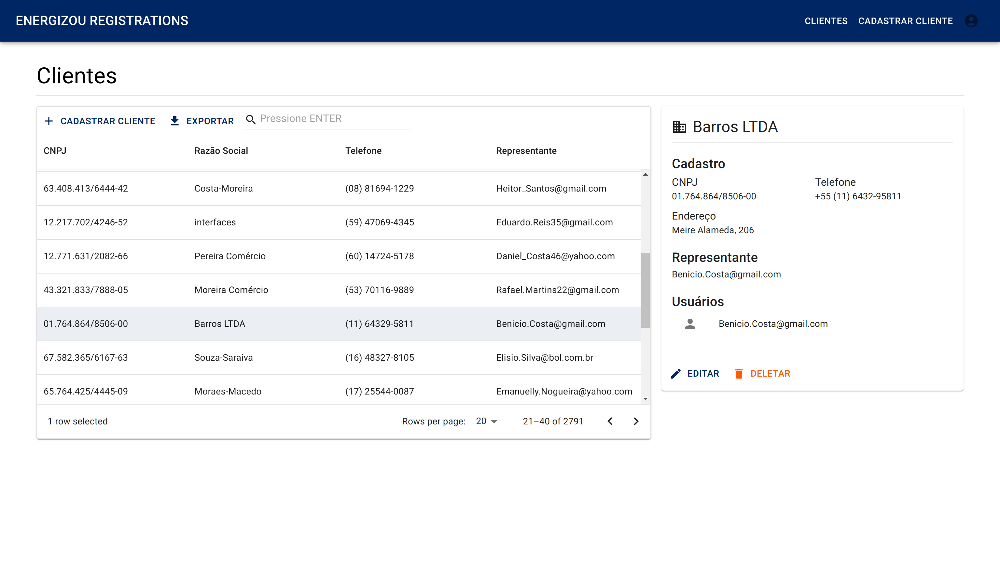
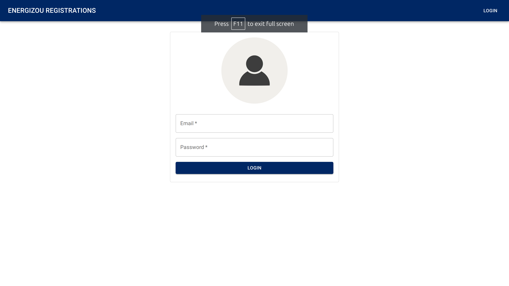
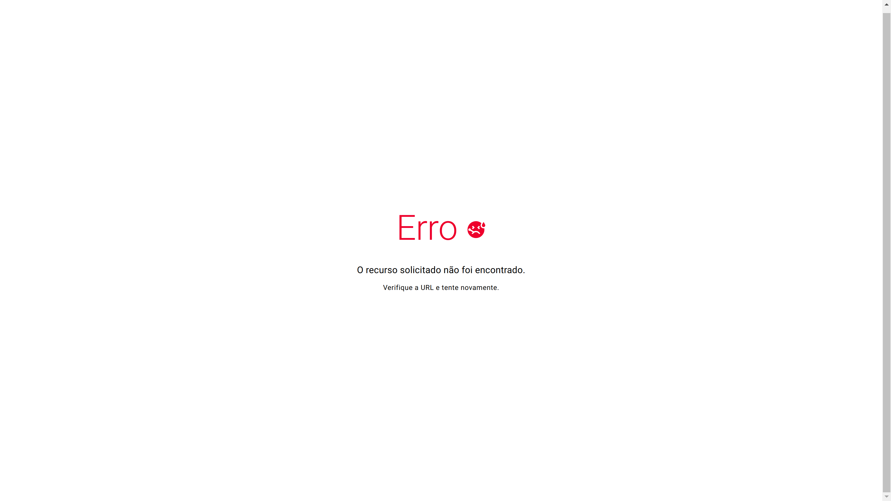
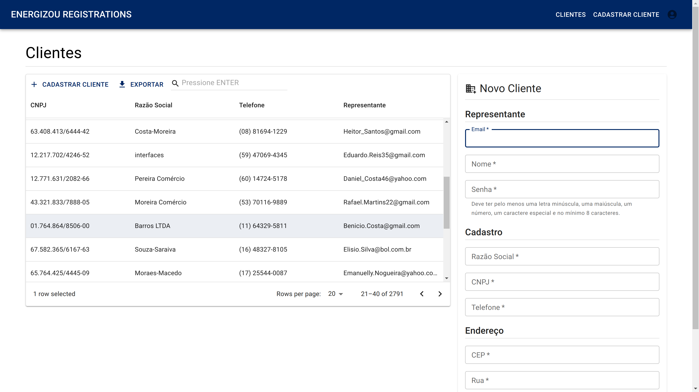
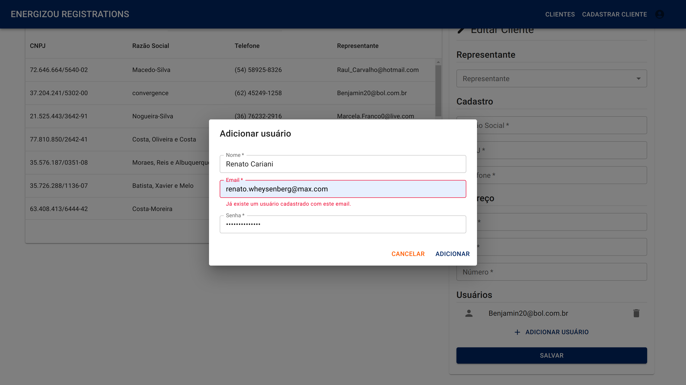
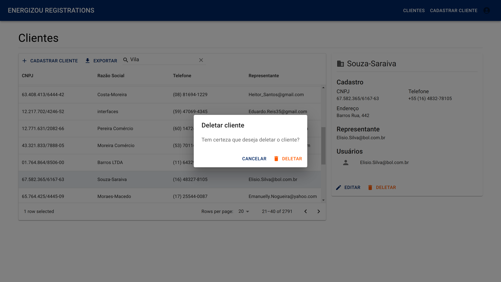

# Energizou Registrations Web

A web application for customers management built with NestJS and React. It was developed during a technical test of a Energizou selection process.

## About

As additional features, I implemented:

- automatic filling of the address based on the CEP entered in the forms, searching for it in public APIs like [BrasilAPI](https://brasilapi.com.br/) and [viacep](https://viacep.com.br/);
- JWT based authentication and authorization using the Context API;
- updating and deletion of companies;
- data exports to CSV;
- unit tests with Vitest;
- searching, filtering and pagination.

## Dependencies

Node: `v19.3.0`

## Run locally

Assuming you have Node.js installed:

- navigate to project frontend folder;
- run

      npm i
      npm run dev

Now the project must be available in your browser.

## Features

<h3 align="center">Login</h3>

<h3 align="center">Error handling</h3>

<h3 align="center">Registrations</h3>

<h3 align="center">Adding new users</h3>

<h3 align="center">Deletion of companies</h3>

